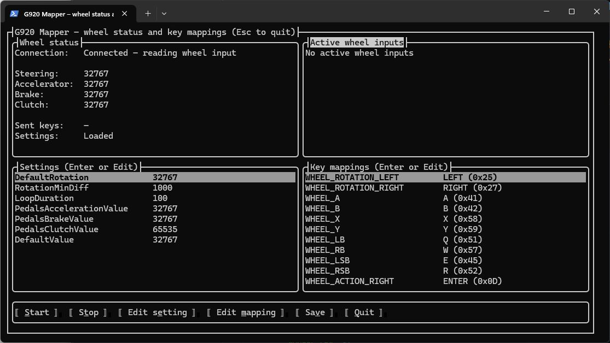

# Logitech G920 Keyboard Mapper



This project maps Logitech G920 racing wheel inputs to keyboard keys, enabling the wheel to be used with older games that require traditional keyboard input (e.g., arrow keys).

The application reads input from the controller through DirectInput, part of the DirectX API. While designed for the G920, it may work with other DirectInput-compatible controllers, though adjustments might be needed for different layouts.

## Configuration file (`wheelkeys.json`)

The configuration is stored in JSON format and specifies the key bindings for various G920 inputs. It can be modified through the terminal user interface or by editing the JSON file directly.

The following is a complete example configuration:

```json
{
    "DefaultRotation": 32767,
    "RotationMinDiff": 1000,
    "LoopDuration": 100,
    "PedalsAccelerationValue": 50000,
    "PedalsBrakeValue": 50000,
    "PedalsClutchValue": 50000,
    "DefaultValue": 32767,
    "Keys": {
        "WHEEL_ROTATION_LEFT": 37,
        "WHEEL_ROTATION_RIGHT": 39,
        "WHEEL_A": 65,
        "WHEEL_B": 66,
        "WHEEL_X": 88,
        "WHEEL_Y": 89,
        "WHEEL_LB": 81,
        "WHEEL_RB": 87,
        "WHEEL_LSB": 69,
        "WHEEL_RSB": 82,
        "WHEEL_ACTION_RIGHT": 13,
        "WHEEL_ACTION_LEFT": 27,
        "WHEEL_ARROW_UP": 38,
        "WHEEL_ARROW_DOWN": 40,
        "WHEEL_ARROW_LEFT": 37,
        "WHEEL_ARROW_RIGHT": 39,
        "WHEEL_ACCELERATOR": 38,
        "WHEEL_BRAKE": 40,
        "WHEEL_CLUTCH": 90
    }
}
```

### Field descriptions

- **`DefaultRotation`**: Default rotation value for the wheel (no action).
- **`RotationMinDiff`**: How much rotation is required to trigger a keyboard event.
- **`LoopDuration`**: Loop interval for polling input in milliseconds.
- **`PedalsAccelerationValue`**: Accelerator pedal threshold that triggers a keyboard event.
- **`PedalsBrakeValue`**: Brake pedal threshold that triggers a keyboard event.
- **`PedalsClutchValue`**: Clutch pedal threshold that triggers a keyboard event.
- **`DefaultValue`**: Pedal input value that should be ignored.
- **`Keys`**: Contains key-value pairs that map G920 inputs to keyboard keys. Values can be provided as hexadecimal strings (`"0x41"`), integers (`65`), or characters (`"A"`). All these formats will map to the `A` key.

### Key mapping

- `WHEEL_ROTATION_LEFT` / `WHEEL_ROTATION_RIGHT`: Mapped to the left and right arrow keys (`37`, `39`).
- `WHEEL_A`, `WHEEL_B`, `WHEEL_X`, `WHEEL_Y`: Correspond to the `A`, `B`, `X`, `Y` buttons on the wheel and can be mapped to different keyboard keys (`65` for `A`, etc.).
- `WHEEL_LB` / `WHEEL_RB`: Left and right bumper buttons on the wheel.
- `WHEEL_LSB` / `WHEEL_RSB`: Left and right stick buttons on the wheel.
- `WHEEL_ACTION_RIGHT` / `WHEEL_ACTION_LEFT`: Action buttons, such as Enter (`13`) and Escape (`27`).
- `WHEEL_ARROW_*`: D-pad arrow buttons mapped to arrow keys (`38`, `40`, `37`, `39`).

## Usage

1. Install the [.NET 10 runtime](https://dotnet.microsoft.com/download/dotnet/10.0).
2. [Download the latest release](https://github.com/artop123/g920-mapper/releases/latest).
3. Extract the archive and run `g920-mapper.exe`.
4. Edit the settings and key mappings through the terminal user interface.
5. Keep the application running while playing. It reads the wheel automatically and uses the configured mappings to emulate keyboard input.

The application does not make permanent changes to the system. Antivirus software may prevent an application downloaded from GitHub from running. If this happens, consider building it from source or adding an antivirus exception.

## Development

Install the [.NET 10 SDK](https://dotnet.microsoft.com/download/dotnet/10.0).

**Clone the repository**

```sh
git clone https://github.com/artop123/g920-mapper
cd g920-mapper
```

**Build, test, and run**

```sh
dotnet restore
dotnet build
dotnet test
dotnet run --project g920-mapper
```

**Publish the application**

```sh
dotnet publish g920-mapper/g920-mapper.csproj -p:PublishProfile=Release
```

The Windows x64 application will be published to the `g920-mapper/publish/` directory.
